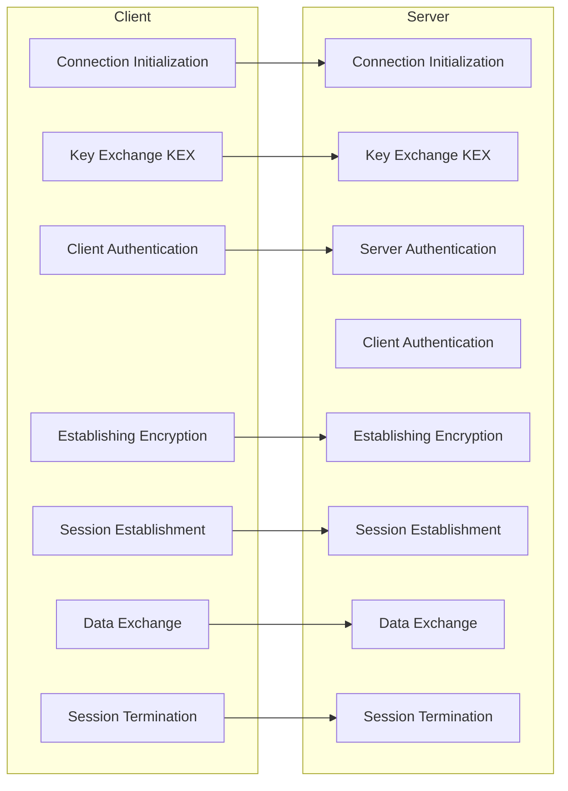

**SSH (pronounced ESS-ESS-HEICH)** stands for **Secure Shell**. It is a *cryptographic network protocol* that provides a *secure* and *encrypted* way to *access and manage remote devices* over an unsecured network, such as the internet. SSH allows users to securely log into remote systems and execute commands, transfer files, and perform other network services.

In the early days of networked computing, protocols like `telnet` and `rlogin` were commonly used for remote access to systems. However, these protocols transmitted data, including passwords, in plaintext, making them vulnerable to eavesdropping and unauthorized access.

In *1995*, *Tatu Ylönen*, a *Finnish researcher*, developed the Secure Shell (SSH) protocol as a secure *alternative to Telnet and rlogin*. His goal was to create a secure method for remote login and encrypted communication between networked devices. Ylönen initially released the SSH protocol as a proprietary software solution. However, realizing the importance of open standards and collaboration, he encouraged the development of an open-source version.

In *1999*, *OpenSSH* was born as an *open-source implementation of the SSH protocol suite*. It was derived from the original SSH implementation, which was freely available but not open source. The OpenSSH project was started by developers associated with the *OpenBSD operating system*. They aimed to create an open-source implementation of SSH that emphasized security, code auditability, and robustness. Over the years, OpenSSH has evolved to include various features beyond the core SSH functionality. This includes support for *encrypted file transfers (SFTP and SCP)*, *port forwarding*, *X11 forwarding*, and more. The project has received contributions from developers worldwide, allowing for ongoing improvements and bug fixes.

OpenSSH gained widespread adoption due to its *security*, *reliability*, and *cross-platform compatibility*. It became the default SSH implementation in many Unix-like operating systems, including Linux, FreeBSD, and macOS. It is now considered the *de facto standard for SSH*. OpenSSH has a strong focus on security and actively addresses vulnerabilities through regular updates and patches. The OpenSSH team maintains a coordinated process to promptly respond to security issues and release secure updates to the software.

## Up and Running with SSH

### Fundamentals of SSH

#### The Purpose

The primary purpose of SSH is to establish a *secure* and *authenticated* connection between a client and a server. It provides *confidentiality*, *integrity*, and *authenticity* of data transmitted between the client and server through strong *encryption* and *cryptographic techniques*.

**OpenSSH** is an *open-source implementation of the SSH protocol* suite. It provides both the *server-side (sshd)* and *client-side (ssh)* components, offering secure remote login, encrypted file transfers, and secure tunneling capabilities. OpenSSH is the *most widely used* and commonly recommended implementation of SSH due to its security, reliability, and extensive feature set.

OpenSSH is actively maintained and developed by a team of dedicated contributors. [Its source code is open and available for inspection](https://github.com/openssh), which allows for community involvement, code audits, and continuous improvement. Due to its security, flexibility, and wide adoption, OpenSSH has become the de facto standard for SSH implementations in many environments. It is extensively used by system administrators, network engineers, developers, and security-conscious individuals for secure remote administration and file transfer tasks.

#### Characteristics of SSH

1. **Encryption**
	- SSH encrypts data transmitted over the network, ensuring that sensitive information such as login credentials, commands, and data payloads are secure and cannot be intercepted by unauthorized parties.
	- This encryption helps maintain confidentiality and privacy in remote access sessions.
2. **Authentication**
	- SSH provides strong authentication mechanisms, including password-based authentication, public key authentication, and multi-factor authentication (MFA).
	- This ensures that only authorized users can access the remote system, adding an extra layer of security.
3. **Data Integrity**
	- SSH uses algorithms like HMAC (Hash-based Message Authentication Code) to verify the integrity of data transmitted between the client and server.
	- This helps detect and prevent data tampering or corruption during transmission, ensuring the reliability of data exchanges.
4. **Port Forwarding and Tunneling**
	- SSH supports port forwarding and tunneling, allowing users to securely access services and resources on remote networks through an encrypted tunnel.
	- This feature enhances network security by protecting sensitive services from direct exposure to the internet.
5. **Key Exchange**
	- SSH uses robust key exchange algorithms, such as Diffie-Hellman key exchange, to establish secure communication channels between the client and server.
	- This ensures that the encryption keys used for data transmission are exchanged securely and cannot be easily compromised.
6. **Platform Independence**
	- SSH is platform-independent, meaning it can be used on different operating systems such as Linux, macOS, Windows, and various Unix-like systems.
	- This makes SSH versatile and widely compatible for remote access across diverse environments.
7. **Versatility**
	- Apart from remote shell access (SSH), SSH also supports secure file transfer (SFTP), secure copy (SCP), and secure execution of remote commands (SSH command execution).
	- This versatility allows users to perform various tasks securely over SSH connections.
8. **Open Standards**
	- SSH is based on open standards and protocols, such as the SSH protocol suite (SSH-2), ensuring interoperability and compatibility across different SSH implementations and software applications.
	- This open nature promotes transparency, security, and collaborative development in the SSH ecosystem.


> [!INFO] Why SSH2 over SSH1
> When choosing between SSH version 2 (SSH2) and SSH version 1 (SSH1), it's crucial to understand the advantages of SSH2 over SSH1 for enhanced security and functionality.
> 
> - SSH2 uses stronger encryption algorithms (AES, 3DES, Blowfish) compared to SSH1.
> - SSH2 provides better protection against man-in-the-middle attacks with advanced key exchange methods like Diffie-Hellman.
> - SSH2 supports secure authentication mechanisms including public key, certificate-based, and keyboard-interactive authentication.
> - SSH2 offers enhanced forwarding and tunneling capabilities for secure communication across networks and encapsulation of diverse protocols.
> 
> Choosing SSH2 over SSH1 is essential for stronger encryption, better protection against attacks, secure authentication mechanisms, and enhanced forwarding and tunneling capabilities. SSH2 provides a more secure and efficient remote access and file transfer environment, making it the preferred choice for secure communications.

### Components of SSH

#### SSH Client & Server

The SSH protocol serves as the underlying communication protocol for secure remote access and other services provided by SSH. It defines the format and structure of messages exchanged between the SSH client and server during the connection process. The SSH protocol includes mechanisms for encryption, authentication, and integrity checks to ensure secure and reliable communication. The protocol supports different versions, such as SSH1 and SSH2, with SSH2 being the more secure and widely used version today.

The SSH architecture is composed of two main components
1. **SSH Server**
    - The SSH server is responsible for hosting the services and resources that clients can connect to securely. It runs on the remote machine that you want to access.
    - When a client initiates an SSH connection, the SSH server handles the authentication, encryption, and session management on the server-side.
    - The SSH server listens for incoming SSH connections on a specific port (default is port 22) and establishes secure communication channels with the client.
    - Configurations for the SSH server can be typically found at `/etc/sshd/ssd_config`
    - Examples of SSH server software include OpenSSH, Microsoft OpenSSH, and Bitvise SSH Server.
2. **SSH Client**
    - The SSH client is the software or tool used to initiate a connection to an SSH server. It runs on the local machine from which the remote server is accessed.
    - The SSH client provides the interface for users to authenticate, securely transmit commands and data, and interact with the remote server.
    - When a client initiates an SSH connection, it establishes a secure communication channel with the server, authenticates the user, and manages the encrypted session.
    - Configurations for SSH Client for the user can be found at `~/.ssh/ssh_config` and for system-wide configurations, it is found at `/etc/ssh/ssh_config`.
    - Examples of SSH client software include OpenSSH (ssh command-line tool), PuTTY, and Bitvise SSH Client.

#### How does SSH work?

Here is a quick rundown of a typical SSH workflow.

1. **Initiation** - The client initiates an SSH connection by sending a connection request to the SSH server.
2. **Server Identification** - The server responds by sending its identification string to the client, including the SSH version, encryption algorithms supported, and other parameters.
3. **Key Exchange Initiation** - The client and server initiate a key exchange process to establish a secure communication channel. This involves negotiating encryption algorithms, key exchange methods, and other cryptographic parameters.
4. **Key Generation** - During the key exchange, both the client and server generate session keys used for encrypting and decrypting data exchanged during the SSH session. This process typically involves using Diffie-Hellman key exchange or other key exchange algorithms to securely generate shared secret keys.
5. **Client Authentication** - Once the key exchange is completed, the client authenticates itself to the server. This can be done using various authentication methods, such as password authentication, public key authentication, or multi-factor authentication (MFA). The client sends its authentication credentials to the server for verification.
6. **Server Authentication** - After receiving the client's authentication credentials, the server verifies the client's identity. If the authentication is successful, the server sends a message confirming the authentication and proceeds to establish the secure connection.
7. **Secure Connection Establishment** - With both client and server authenticated, the secure connection is established using the negotiated encryption algorithms and session keys. All data transmitted between the client and server is encrypted and integrity-checked, ensuring confidentiality and data integrity.
8. **Session Management** - Once the secure connection is established, an SSH session is created, allowing the client to interact securely with the server. The session remains active until either the client or server terminates the connection.
9. **Data Exchange** - During the SSH session, data exchanges occur securely between the client and server. This can include executing remote commands, transferring files (using SFTP or SCP), forwarding ports, or other interactions, all protected by the established secure connection.
10. **Session Termination** - When the SSH session is complete, either the client or server terminates the connection, closing the secure communication channel and releasing resources allocated for the session.




### SSH Authentication

The following are some of the authentication methods used with SSH
1. **Password-based Authentication**
    - Users provide their *username* and *password* to authenticate themselves.
    - The server verifies the provided credentials against a stored user database (e.g., /etc/passwd, LDAP, or Active Directory).
    - Password-based authentication is a common method but may be less secure compared to other methods, especially if weak or easily guessable passwords are used.
2. **Public Key-based Authentication**
    - Public key authentication uses asymmetric key pairs, meaning a *public key* and a *corresponding private key*.
    - The *user generates a key pair* on their local machine and *stores the public key on the remote server*.
    - During authentication, the client proves its identity by presenting its private key, and the server verifies it using the stored public key.
    - Public key-based authentication is *highly secure and recommended for SSH*. It eliminates the need to transmit passwords over the network and protects against password-based attacks.
    - This is the *most common type of authentication* used with SSH.
3. **Keyboard-Interactive Authentication**
    - Keyboard-interactive authentication is a *flexible and customizable authentication method*.
    - It can prompt users for various types of credentials, such as passwords, one-time passwords, or challenge-response questions.
    - This method allows for *multiple rounds of interaction* between the client and server during the authentication process.
    - Keyboard-interactive authentication can be used as a *fallback method* when other authentication methods fail or are unavailable.
4. **Certificate-based Authentication**
    - Certificate-based authentication uses *digital certificates issued by a trusted Certificate Authority (CA)*.
    - Similar to public key-based authentication, the user presents a client certificate instead of a private key.
    - The server verifies the authenticity of the certificate by checking its validity and the CA's signature.
    - Certificate-based authentication provides an extra layer of trust, as the CA validates the user's identity.
5. **Multi-factor Authentication (2FA)**
    - Multi-factor authentication combines multiple authentication factors to enhance security.
    - It typically involves *combining something the user knows* (e.g., a password) with *something the user has* (e.g., a mobile device or hardware token).
    - SSH servers can be configured to require both a password and a second factor, such as a one-time password generated by a mobile app or hardware token.

SSH allows for configuring and enforcing authentication methods based on security requirements and user preferences. The choice of authentication method depends on the level of security desired, ease of use, and available infrastructure. Public key-based authentication is generally recommended for its strong security properties, while additional methods like two-factor authentication can provide extra layers of protection.

Password-based authentication & Public Key-based authentication are the most common methods of setting up SSH fore remote machines. Hence this guide will go over these two methods.

#### Password Authentication

The `ssh` command can be used to connect to the remote server. The command follows the general syntax as showcased below.

```bash
# Syntax
ssh username@server_ip

# Example 
ssh root@178.231.67.39
```

Upon execution of this command, the client requests an SSH connection to the user at the requested IP address. The server then waits for the user to enter the password to connect to the server. Upon reception of the verified password, the client and server are connected via SSH and the client can execute commands on the server via SSH. 

This method is however not recommended as the integrity of this method depends on the efficient management of the password by the user, plus it also open up for password compromises and brute force attacks. 

#### Public Key-Based Authentication

Public Key-based authentication uses an asymmetric key-pair to authenticate the user making the remote connection. There are a few steps involved in setting up a key-pair based authentication. The general process is outlined below.
1. **Key-pair Generation** - A key-pair is generated on the client machine using the `ssh-keygen` command. There are several encryption algorithms that can be used to generate key-pairs each with their pros, cons and legacy. There is an option to set a key-phrase for accessing the key-pair, and it is recommended to set it up as it adds an additional layer of authentication on top of the SSH key.   
2. **Copy Public Key to Server** - The public key part of the key-pair is then transferred to the server. But the private key remains on the client and is kept safe.
3. **Client Initiates SSH Connection** - The SSH client initiates a connection to the SSH server using the `ssh` command. The client presents its private key to the server for authentication.  
4. **Server Verifies Public Key** - The server (`sshd`) checks the client's public key against the authorized keys file for the user that the client is requesting access to. If a matching public key is found, the server accepts the connection and authenticates the client. If the key does not match or is not present, the server denies access.
5. **Authenticated Session Established** - Once the server verifies the client's public key, an authenticated session is established. The client can interact securely with the server using SSH commands or transfer files securely.

#### Multi Factor Authentication

### SSH Key Management

#### Generating SSH Key Pairs

SSH Key-Pairs can be generated with the use of the `ssh-keygen` command that comes as part of SSH. The `ssh-keygen` command can generate SSH keypairs with a variety of encryption algorithms, each with their pros, cons and use cases. Some of the most commonly used algorithms are
1. **RSA** *(Rivest-Shamir-Adleman)* - RSA is a *widely used* asymmetric encryption algorithm. It offers *strong security and good performance*. RSA key pairs are compatible with almost all SSH clients and servers.
2. **DSA** *(Digital Signature Algorithm)* - DSA is an *older asymmetric encryption algorithm*. It provides *strong security* but may have *slower performance* compared to RSA. DSA key pairs are compatible with most SSH clients and servers, but some implementations have *deprecated or limited support* for DSA.
3. **ECDSA** *(Elliptic Curve Digital Signature Algorithm)* - ECDSA is an asymmetric encryption algorithm based on *elliptic curve cryptography*. It offers *strong security* with *shorter key lengths*, resulting in *improved performance*. ECDSA key pairs are supported by many modern SSH implementations.
4. **Ed25519** - Ed25519 is a newer asymmetric encryption algorithm based on *elliptic curve cryptography*. It provides *strong security*, *excellent performance*, and *smaller key sizes* compared to RSA and DSA. Ed25519 key pairs are supported by many modern SSH implementations.

The basic syntax for the `ssh-keygen` command is as follows.

```shell
# ssh-keygen command syntax
ssh-keygen -t <encryption-algo> -b <key-bits> -C "Comment Here" -f ~/.ssh/name_of_key

# -t & -b flags set they type of algorithm and encryption bits
# -C flag is used to supply a comment
# -f flag is used to supply the file path of the key to be generated
# -N flag is used to pass the [optional] passphrase 
```

Following code snippet showcases the commonly used encryption algorithms and commands used to generate a key-pair.

```bash
# RSA
ssh-keygen -t rsa -b 2048
ssh-keygen -t rsa -b 2048 -C "Comment on Key"
ssh-keygen -t rsa -b 2048
ssh-keygen -t rsa -b 2048 -C "Comment on Key" -f "~/.ssh/name_of_key"

# DSA
ssh-keygen -t dsa -b 2048
ssh-keygen -t dsa -b 2048 -C "Comment on Key"
ssh-keygen -t dsa -b 2048 -C "Comment on Key" -f "~/.ssh/name_of_key"

# ECDSA
ssh-keygen -t ecdsa -b 256
ssh-keygen -t ecdsa -b 256 -C "Comment on Key"
ssh-keygen -t ecdsa -b 256 -C "Comment on Key" -f "~/.ssh/name_of_key"

# ED25519
ssh-keygen -t ed25519
ssh-keygen -t ed25519 -C "Comment on Key"
ssh-keygen -t ed25519 -C "Comment on Key" -f "~/.ssh/name_of_key"
```


#### Copying Key-Pairs to Target Machines

After generating the key-pair, the key pair needs to be moved to the SSH server. This task can be accomplished by a number of ways. 

1. **Using `ssh-copy-id` command**
    - The `ssh-copy-id` command simplifies the process of copying the public key to the server.  
    - This command copies the public key to the remote server and adds it to the `authorized_keys` file in the user's home directory.
2. **Manual Copying**
    - If the `ssh-copy-id` command is not available or not suitable for your system, you can manually copy the public key to the server.
    - On the client machine, use a text editor or command-line tools to open the public key file (`~/.ssh/id_rsa.pub`, `~/.ssh/id_dsa.pub`, `~/.ssh/id_ecdsa.pub`, or `~/.ssh/id_ed25519.pub`).
    - Copy the contents of the public key file.
    - On the server, open the `~/.ssh/authorized_keys` file (create it if it doesn't exist) in a text editor.
    - Paste the copied public key into a new line in the `authorized_keys` file and save it.
3. **Secure File Transfer**
    - Use a secure file transfer method, such as SCP or SFTP, to transfer the public key file to the server.
    - Example using SCP:
        `scp ~/.ssh/id_rsa.pub username@server_ip:~/.ssh/authorized_keys`
    - This command copies the public key file directly to the `authorized_keys` file on the server

```shell
# Using the ssh-copy-id command 
ssh-copy-id -i <public-key-path> username@server_ip
```

```shell
# Using Secure Copy (or) SCP

# Step 1: Copy the public key to the remote machine
scp <public-key-path> usernameo@server_ip:<path-on-target-machine>

# Step 2: SSH into the server with password authentication
ssh username@server_ip
# Enter the password when prompted -> Should take to the home dir

# Step 3: Ensure ~/.ssh/authorized_keys keys file exists
touch ~/.ssh/authorized_keys

# Step 4: Append the copied public key to the authorized_keys file
cat <public-key-path> >> ~/.ssh/authorized_keys

# Step 5: Ensure correct read,write permissions are set
chmod 700 ~/.ssh && chmod 600 ~/.ssh/authorized_keys
# Here sudo is most likely not required, but if prompted use 'sudo'
```

That being said, one must almost always go with the `ssh-copy-id` route as it is clean, simple and gets the job done quickly. The other methods provide a way to perform the same action just in case somehow the `ssh-copy-id` command is unavailable.

#### SSH Key Rotation

- SSH Key rotation
- Revoking compromised Keys 

### SSH Configuration

- Client side configurations via ssh_config
- Server side configurations via sshd_config 

### Security Hardening

- Disable root login
- Implement IP Whitelisting & firewall rules
- Set up SSH logs monitoring
- Keeping the software and config up to date

### Copy Files with SCP & SFTP

- Securely copy files with SCP and SFTP

### Forwarding and Proxy

- Securely forward SSH connections to remote machines
- Security implications and best practices of forwarding
- Working with Bastion Hosts (or) Jump Hosts

### SSH Certificates

- Understanding certificate authorities (CA) and how to issue SSH certs
- Use SSH certificates for centralized key management

### Regulatory Compliance

## Common Workflows

1. SSH into Linux from Linux - Create an SSH Key and Connect to a Linux Machine from a Linux Machine
2. SSH into Linux from Windows PowerShell - Create an SSH Key and Connect
3. Setting up SSH in AWS EC2
4. Setting up SSH in Azure VMs
5. Setting up SSH for Ansible Automation

## Troubleshooting FAQs

1. Connection Time Out Error
2. Access Denied Error

## Resources

1. Website - [OpenSSH Website](https://www.openssh.com/)
2. GitHub Account - [OpenSSH on GitHub](https://github.com/openssh)
3. Reddit SSH Community - [r/ssh](https://www.reddit.com/r/ssh/)

%% SSH Architecture and Components
Understanding the architecture and components of SSH helps in comprehending how SSH connections are established, authenticated, and secured. It forms the basis for configuring and managing SSH connections, key pairs, and authentication methods.
1. **SSH Client** - The SSH client is the software or tool used by the user to initiate a secure connection to the remote server. It allows the user to authenticate themselves and interact with the server. Common SSH clients include OpenSSH (command-line tool), PuTTY (Windows-based client), and Bitvise SSH Client.
2. **SSH Server** - The SSH server is the software running on the remote system that accepts incoming SSH connections from clients. It authenticates users and provides access to the server's resources. OpenSSH is the most widely used SSH server implementation.
3. **SSH Protocol** - The SSH protocol defines the rules and specifications for secure communication between the client and the server. It encompasses various aspects such as encryption algorithms, authentication methods, and key exchange protocols. The current widely used version of the SSH protocol is SSH-2 (SSH version 2).
4. **Encryption Algorithms** - SSH employs various encryption algorithms to ensure the confidentiality and integrity of the transmitted data. This includes symmetric key algorithms like *AES (Advanced Encryption Standard)*, *3DES (Triple Data Encryption Standard)*, and *Blowfish*, as well as asymmetric key algorithms like *RSA (Rivest-Shamir-Adleman)* and *DSA (Digital Signature Algorithm)*.
5. **Authentication Methods** - SSH supports *multiple authentication methods* to verify the identity of users connecting to the server. These methods include *password-based authentication*, *public key authentication*, *certificate-based authentication*, and more. Public key authentication is commonly used for its enhanced security and convenience.
6. **SSH Keys** - SSH keys play a crucial role in the SSH architecture. A key pair consists of a private key stored on the client-side and a corresponding public key stored on the server-side. Public key authentication involves the client presenting its public key to the server for authentication, proving its identity without transmitting a password over the network.

Key Concepts: Public Key Cryptography and Authentication
Understanding public key cryptography and authentication is crucial for securely authenticating users and establishing encrypted connections in SSH. It enables secure and efficient remote access, file transfers, and automation tasks.
1. **Public Key Cryptography** - Public key cryptography, also known as asymmetric cryptography, is a fundamental concept in SSH. It involves the use of a key pair: a public key and a private key. The public key is freely distributed, while the private key remains secret and known only to the owner.
2. **Key Pair Generation** - To use public key cryptography in SSH, a key pair must be generated. The private key is generated on the client-side, and the corresponding public key is derived from it. Various algorithms such as RSA or DSA are used for key pair generation.
3. **Public Key Distribution** - The public key is shared with the SSH server or systems the user wants to authenticate against. It can be manually copied and added to the authorized keys file on the server, or more advanced mechanisms like SSH certificates or centralized key management systems can be used for distribution.
4. **Public Key Authentication** - In SSH, public key authentication is a secure and convenient method for authenticating users. During the authentication process, the client presents its public key to the server. The server checks if the corresponding private key is available, and if so, allows the client to authenticate without transmitting a password over the network.
5. **Key-Based Authentication** - Key-based authentication relies on the private key remaining secure on the client-side. It eliminates the need for passwords, enhancing security and convenience. However, it is crucial to protect the private key with strong passphrase-based encryption and follow secure key management practices.
6. **Host Key** - In addition to user authentication, SSH also employs host keys for server identification. When a client connects to a server for the first time, the server's host key is presented and stored on the client-side. In subsequent connections, the client verifies the server's identity by checking the stored host key.

## SSH Client and Server Setup
### SSH Configuration Files and Options
1. **SSH Client Configuration File** - The SSH client uses a configuration file typically located at "~/.ssh/config" (on Unix-like systems) or "%USERPROFILE%\.ssh\config" (on Windows systems). This file allows you to define custom settings for SSH connections.
2. **SSH Server Configuration File** - The SSH server also has a configuration file, commonly located at "/etc/ssh/sshd_config" (on Unix-like systems). This file allows you to configure various server-side settings and behavior.
3. **Client-side Configuration Options** - In the client configuration file, you can set options such as the default username, preferred authentication methods, preferred cipher and MAC algorithms, connection timeouts, and port forwarding settings. These options help customize the client's behavior when establishing SSH connections.
4. **Server-side Configuration Options** - The server configuration file allows you to specify settings such as allowed authentication methods, allowed user accounts, TCP port to listen on, banner messages, access restrictions, and more. These options help tailor the server's behavior and enhance security.
5. **Global and Host-specific Configuration** - SSH configuration files support both global settings that apply to all connections and host-specific settings that apply only to specific hosts or groups of hosts. This flexibility allows you to define different configurations based on your requirements.
6. **SSH Client Command-line Options** - In addition to configuration files, the SSH client also supports command-line options that can override configuration settings for a particular connection. These options provide a convenient way to customize specific connections on the fly.

## Secure Remote Access with SSH
1. **Establishing SSH Connection** - To establish a secure remote access session using SSH, initiate an SSH connection from the client to the SSH server. Use the SSH client tool (e.g., OpenSSH, PuTTY) and specify the server's hostname or IP address, along with the appropriate username.
2. **Authentication Methods** - During the SSH connection process, the client authenticates itself to the server using the configured authentication method. Common methods include password-based authentication, public key authentication, or a combination of both. Public key authentication is recommended for its enhanced security and convenience.
3. **Password-based Authentication** - Password-based authentication requires the user to enter a password to authenticate. The password is securely transmitted over the encrypted SSH connection. It is essential to use strong, unique passwords to ensure security.
4. **Public Key Authentication** - Public key authentication involves the use of SSH key pairs. The client presents its public key to the server for authentication. The server checks if the corresponding private key is available, and if so, authenticates the client without transmitting a password. This method provides stronger security and eliminates the need for password input.
5. **Interactive Shell and Command Execution** - Once the SSH connection is established and authenticated, you can access an interactive shell on the remote server. This allows you to execute commands remotely, manage files, and perform administrative tasks as if you were directly logged into the server.
6. **Secure Data Transmission** - All data transmitted over an SSH connection is encrypted, ensuring the confidentiality and integrity of the information exchanged between the client and the server. This protects sensitive data, including passwords, commands, and files, from being intercepted or tampered with.
7. **Session Management and Termination** - When you are done with the SSH session, it is important to properly terminate the connection. You can exit the shell or use the "exit" command to close the SSH session. This ensures that the connection is closed securely and any resources associated with the session are released.

## Secure File Transfer with SCP and SFTP
For securely transferring files to and from a remote SSH server, there are two ways as follows.
1. **SCP (Secure Copy)** - SCP is a command-line utility that allows secure file transfers between a local system and a remote server over SSH. It provides a simple and efficient way to copy files and directories securely. The syntax for using SCP is typically `scp [options] <source> <destination>`.
2. **SFTP (SSH File Transfer Protocol)** - SFTP is a more feature-rich file transfer protocol that operates over SSH. It provides a secure and reliable method for transferring files between a client and a remote server. SFTP supports various operations like uploading, downloading, renaming, deleting, and creating directories. SFTP clients are available for various operating systems, and some graphical FTP clients also support SFTP.

Both SCP and SFTP can leverage *public key authentication* for secure and passwordless file transfers. By using SSH key pairs, you can authenticate to the server without the need for entering passwords during file transfers. With SCP, you can copy files and directories recursively between the local system and the remote server. For example, you can use `scp -r` to recursively copy directories and their contents. SFTP provides similar functionality for transferring files and directories.

During file transfers, SCP and SFTP preserve file permissions, ownership, and timestamps by default. This ensures that the transferred files retain their original attributes on the remote server.

Both SCP and SFTP support compression to reduce the size of data transferred over the network, which can improve transfer speeds, especially for large files. Additionally, bandwidth limitation options can be used to control the maximum bandwidth used during file transfers.

Secure file transfer with SSH ensures that files are transferred securely, preserving their integrity and confidentiality. SCP and SFTP are widely used tools for securely transferring files between local and remote systems, making them essential for managing and exchanging data in a DevOps environment.

## SSH Agent and Key Management
1. **SSH Agent** - The SSH Agent is a program that runs on the client-side and holds the private keys used for SSH authentication. It securely stores the private keys and provides them when needed during SSH connections, eliminating the need to enter the passphrase repeatedly.
2. **Agent Forwarding** - Agent forwarding is a feature that allows the SSH Agent on the client system to be used for authentication when connecting to other remote systems. It enables seamless authentication without storing private keys on intermediate systems, enhancing security.
3. **Key Management** - Managing SSH keys involves generating key pairs, securely storing the private keys, distributing the public keys to servers or systems for authentication, and revoking or updating keys when needed. Key management practices include protecting private keys with passphrases, regularly rotating keys, and securely backing up key material.
4. **SSH Key-Based Authentication** - SSH key-based authentication relies on the SSH Agent to provide the private key during authentication. The SSH client communicates with the SSH Agent to request the appropriate private key for authentication. This method enhances security by eliminating the need to store private keys on disk or transmit them over the network.
5. **SSH Key Management Tools** - Several tools and utilities are available to manage SSH keys effectively. These tools offer features like key generation, passphrase management, key rotation, key revocation, and centralized key management. Some popular tools include ssh-keygen, ssh-add, keychain, and centralized key management systems like HashiCorp Vault.
6. **Key Rotation and Revocation** - Regularly rotating SSH keys helps maintain security by reducing the window of exposure if a private key is compromised. Key revocation is essential if a key is lost or compromised to prevent unauthorized access. It involves removing the compromised key from authorized keys files or revoking the corresponding certificate.

## SSH Tunneling and Port Forwarding
1. **What is SSH Tunneling** - SSH tunneling, also known as SSH port forwarding, is a technique that allows you to create a secure connection between a local computer and a remote server, enabling access to services running on the remote system as if they were local.
2. **Local Port Forwarding** - Local port forwarding allows you to forward a local port on your computer to a remote server. Any traffic directed to the local port is securely tunneled to the remote server and then forwarded to a specified destination within the server's network.
3. **Remote Port Forwarding** - Remote port forwarding allows you to forward a remote port on the server to a local computer. Any traffic directed to the remote port is securely tunneled to the server, and then forwarded to a specified destination on your local computer.
4. **Dynamic Port Forwarding (SOCKS Proxy)** - Dynamic port forwarding allows you to set up a local SOCKS proxy server that securely routes your network traffic through an SSH tunnel. This enables you to access various services and resources on remote networks through the SOCKS proxy.
5. **Use Cases for SSH Tunneling** - Securely accessing remote services, such as databases, web servers, or other applications, through an encrypted tunnel.
	- Bypassing network restrictions or firewalls to access restricted resources or services.
	- Encrypting and securing communication over an untrusted network, such as public Wi-Fi, by routing traffic through an SSH tunnel.
	- Establishing a secure tunnel for remote desktop protocols like RDP or VNC.
6. **Configuring SSH Tunneling** - To configure SSH tunneling, you specify the appropriate options when establishing an SSH connection. This can be done through command-line options or by configuring the SSH client's configuration file.

SSH tunneling is a powerful feature of SSH that provides a secure and encrypted means to access remote services and resources. It offers flexibility and enhances security by encapsulating network traffic within an SSH connection, protecting sensitive data and bypassing network restrictions.

## SSH Security Best Practices
1. **Use Strong Passwords or SSH Keys** - Ensure that strong and unique passwords are used for SSH authentication if password-based authentication is enabled. Alternatively, prefer SSH key-based authentication, which provides stronger security and eliminates the risk of password-related vulnerabilities.
2. **Disable Password Authentication *(if feasible)*** - Consider disabling password-based authentication altogether and rely solely on SSH key-based authentication. This significantly enhances security by removing the possibility of brute-force password attacks.
3. **Protect Private SSH Keys** - Ensure that private SSH keys are securely stored on the client systems and protected with strong passphrases. Avoid storing private keys on shared or untrusted systems.
4. **Regularly Update and Patch SSH Software** - Keep the SSH client and server software up to date with the latest security patches and updates. This helps protect against known vulnerabilities and ensures that you benefit from the latest security features.
5. **Restrict SSH Access** - Configure SSH access controls to restrict access to authorized users only. This can include using firewall rules, IP whitelisting, or TCP Wrappers to limit SSH connections to specific IP addresses or networks.
6. **Limit Privileged Access** - Grant SSH access only to necessary users and limit their privileges to minimize the risk of unauthorized access or misuse.
7. **Monitor SSH Logs** - Enable SSH logging and regularly review SSH logs for any suspicious activities or unauthorized access attempts. Implementing log monitoring and alerting mechanisms can help detect potential security incidents.
8. **Two-Factor Authentication (2FA)** - Consider enabling two-factor authentication for SSH, which adds an extra layer of security by requiring a second form of authentication in addition to the SSH key or password.
9. **Implement Network Intrusion Detection/Prevention System (IDS/IPS)** - Utilize IDS/IPS solutions to monitor SSH traffic and detect potential threats or suspicious activities.
10. **Regularly Audit and Rotate SSH Keys** - Periodically audit SSH key usage, revoke any unused or unnecessary keys, and regularly rotate SSH keys to mitigate the risk of key compromise.

## Troubleshooting SSH Connections
1. **Verify Network Connectivity** - Ensure that there is network connectivity between the client and the server. Check network settings, firewalls, and routing configurations to ensure that SSH traffic can reach the server.
2. **Check SSH Server Status** - Verify that the SSH server is running and accessible on the server. Check the SSH server process and logs to ensure it is functioning properly.
3. **Verify SSH Client Configuration** - Review the SSH client configuration file or command-line options to ensure that the correct settings are specified, such as the correct hostname or IP address, port number, and authentication method.
4. **Check SSH Server Configuration** - Review the SSH server configuration file on the remote server to ensure that the server is properly configured, including correct port settings, allowed authentication methods, and user access permissions.
5. **Check SSH Key Permissions** - Ensure that the SSH key files on the client system have the correct permissions. The private key should have permissions set to 600 (read and write only for the owner), and the public key should have permissions set to 644 (read-only for everyone).
6. **Enable SSH Client Verbosity** - Increase the verbosity level of the SSH client by using the "-v" or "-vv" option. This provides more detailed debugging information, which can help identify the cause of the issue.
7. **Check SSH Logs** - Review the SSH logs on both the client and server to identify any error messages or warning signs that can help diagnose the problem. The logs are typically located in "/var/log/auth.log" (on Unix-like systems) or "%USERPROFILE%\.ssh\logs" (on Windows systems).
8. **Test with Different SSH Clients** - If possible, try connecting to the SSH server using different SSH client tools or versions. This can help determine if the issue is specific to a particular client.
9. **Firewall and Security Considerations** - Ensure that firewalls or security groups allow SSH traffic on the appropriate port. Check network security configurations and consider any additional security measures that may be in place, such as intrusion prevention systems or packet filtering.
10. **Seek Help from the SSH Community** - If you are unable to resolve the SSH issue, reach out to the SSH community forums or mailing lists for assistance. Many experienced users and developers can provide guidance and solutions for common SSH problems.

## SSH Tips and Tricks
1. **SSH Config File** - Utilize the SSH configuration file (typically located at "~/.ssh/config" on Unix-like systems) to define custom configurations for SSH connections. This allows you to set default options, define aliases for hosts, and configure advanced settings like connection timeouts, port forwarding, and proxy settings.
2. **SSH Multiplexing** - Enable SSH multiplexing to reuse existing SSH connections and reduce connection setup overhead. This allows you to open multiple SSH sessions over a single connection, saving time and resources.
3. **ProxyJump (Jump Hosts)** - If you need to connect to a remote server via an intermediate jump host, use the ProxyJump option in the SSH configuration file. This simplifies the process and eliminates the need for multiple SSH connections.
4. **SSH Agent Forwarding** - Enable SSH agent forwarding when connecting to intermediate servers or bastion hosts. This allows you to use your local SSH agent's keys for authentication, even when hopping through multiple hosts.
5. **Aliases and Shell Functions** - Create aliases or shell functions for commonly used SSH commands or complex SSH configurations. This saves time and makes it easier to connect to frequently accessed remote systems.
6. **SSH ControlMaster and ControlPersist** - Utilize the ControlMaster and ControlPersist options in the SSH configuration file to create persistent SSH connections. This speeds up subsequent SSH connections to the same host by reusing an existing connection.
7. **X11 Forwarding** - Enable X11 forwarding to run graphical applications on a remote server and display them locally. This is useful when working with applications that have graphical interfaces or require X Window System support.
8. **SSH Escape Characters** - Learn and utilize SSH escape characters to perform actions during an SSH session, such as suspending the session, terminating a hung connection, or requesting a remote command execution.
9. **Using SSH Keys with Passphrases** - Add SSH keys to the SSH agent and use passphrases for added security. The SSH agent securely stores the decrypted keys, eliminating the need to enter passphrases repeatedly during an SSH session.
10. **Shell Integration** - Explore shell integrations and tools like "ssh-copy-id" to simplify the process of copying SSH public keys to remote servers. This helps streamline the SSH key authentication setup.

## Alternatives to SSH and Additional Tools
1. **Mosh (Mobile Shell)** - Mosh is a remote terminal application that provides a robust and responsive connection, even on high-latency or unstable network connections. It is designed to handle intermittent connectivity and allows seamless roaming between different network connections.
2. **WireGuard** - WireGuard is a modern and lightweight VPN (Virtual Private Network) protocol that can be used as an alternative to SSH for secure remote access and network connectivity. It offers fast and efficient performance while maintaining strong security.
3. **Ansible** - Ansible is an automation tool that can be used for configuration management, application deployment, and orchestration tasks. While not a direct replacement for SSH, Ansible leverages SSH as a transport mechanism for remote command execution and configuration management.
4. **Teleport** - Teleport is an open-source remote access and authentication solution that provides secure access to SSH servers and Kubernetes clusters. It offers features like multi-factor authentication, session recording, and role-based access control for enhanced security and auditability.
5. **Guacamole** - Apache Guacamole is a clientless remote desktop gateway that allows access to remote desktop environments through a web browser. It supports various protocols, including SSH, and provides a unified interface for accessing remote systems.
6. **Bastion Hosts (Jump Hosts)** - In addition to SSH, consider utilizing bastion hosts or jump hosts as an extra layer of security when connecting to remote systems. These are dedicated servers that act as intermediaries for SSH connections, providing an extra barrier to protect sensitive resources.
7. **VPN (Virtual Private Network)** - A VPN can be used as an alternative to SSH for secure remote access to a network. It creates a secure and encrypted tunnel between the client and the network, allowing remote users to access resources as if they were directly connected to the network.
8. **Web-based SSH Clients** - Web-based SSH clients, such as GateOne or Shellngn, provide an alternative way to access SSH servers directly through a web browser without requiring a dedicated SSH client installation.
9. **Session Recording and Audit Tools** - Consider using session recording and audit tools like OpenSSH's audit subsystem or third-party tools to record and monitor SSH sessions for compliance, security, and auditing purposes
10. **Containerization and Orchestration** - Utilize containerization and orchestration platforms like Docker and Kubernetes, which have built-in support for SSH-based access and management of containers and cluster nodes.

```
Section 1: Introduction to SSH
- What is SSH?
- How Does SSH Work?
- Benefits of SSH
- SSH Terminology

Section 2: SSH Client and Server Setup
- Installing SSH Client
- Installing SSH Server
- SSH Configuration Files

Section 3: SSH Authentication Methods
- Password-based Authentication
- SSH Key-based Authentication
- Two-Factor Authentication (2FA)

Section 4: SSH Commands and Basic Usage
- Connecting to a Remote Server
- Transferring Files with SCP and SFTP
- Executing Remote Commands with SSH

Section 5: SSH Tunneling
- What is SSH Tunneling?
- Local Port Forwarding
- Remote Port Forwarding
- Dynamic Port Forwarding (SOCKS Proxy)
- Use Cases for SSH Tunneling
- Configuring SSH Tunneling

Section 6: SSH Security Best Practices
- Use Strong Passwords or SSH Keys
- Disable Password Authentication (if feasible)
- Protect Private SSH Keys
- Regularly Update and Patch SSH Software
- Restrict SSH Access
- Limit Privileged Access
- Monitor SSH Logs
- Two-Factor Authentication (2FA)
- Implement Network Intrusion Detection/Prevention System (IDS/IPS)
- Regularly Audit and Rotate SSH Keys

Section 7: SSH Troubleshooting
- Verify Network Connectivity
- Check SSH Server Status
- Verify SSH Client Configuration
- Check SSH Server Configuration
- Check SSH Key Permissions
- Enable SSH Client Verbosity
- Check SSH Logs
- Test with Different SSH Clients
- Firewall and Security Considerations
- Seek Help from the SSH Community

Section 8: SSH Tips and Tricks
- SSH Config File
- SSH Multiplexing
- ProxyJump (Jump Hosts)
- SSH Agent Forwarding
- Aliases and Shell Functions
- SSH ControlMaster and ControlPersist
- X11 Forwarding
- SSH Escape Characters
- Using SSH Keys with Passphrases
- Shell Integration

Section 9: SSH Alternatives and Additional Tools
- Mosh (Mobile Shell)
- WireGuard
- Ansible
- Teleport
- Guacamole
- Bastion Hosts (Jump Hosts)
- VPN (Virtual Private Network)
- Web-based SSH Clients
- Session Recording and Audit Tools
- Containerization and Orchestration
``` %%
